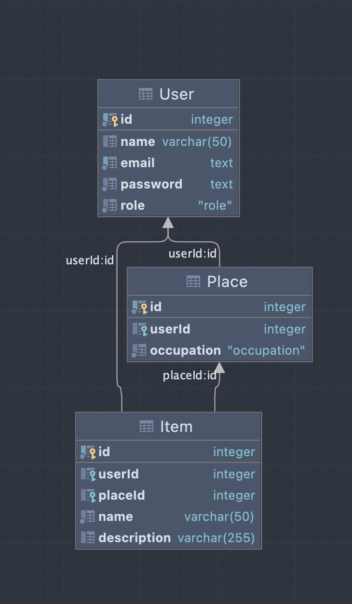

# Nelite web app feat. Nelige

## Description

**Nelige** is a web app that simulates an imaginary working warehouse system. It includes front as well as back end of the app.

## Database ERD

<p align="center">
    
</p>

### Clarification

Since this a warehouse simulation, database contains enteties for warehouse's proper work.

So far there are:

- **User** - Model, describing a User, that has a name, email, password, and a role, that could be set to one of the following: *USER*, *WORKER*, *ADMIN*. In addition to that each user could 'own' a place(s) in the warehouse facility that could contain stored items.
- **Place** - A physical place that a User could own, which contains stored items, occupation ranges from *UNOCCUPIED* to *OCCUPIED*.
- **Item** - User's items that are stored withing warehouse facility at a certain Place. Each item has a name and it also could contain a short description for it to be easier to distinguish.

## Running the app

```bash
# development
$ npm run start

# watch mode
$ npm run start:dev

# production mode
$ npm run start:prod
```

## Test

```bash
# unit tests
$ npm run test

# e2e tests
$ npm run test:e2e

# test coverage
$ npm run test:cov
```

## Stay in touch

- Author - Ilya Neledov
- Website - <https://nelite-app.herokuapp.com/>
- Twitter - [@neliitsme](https://twitter.com/neliitsme)
  